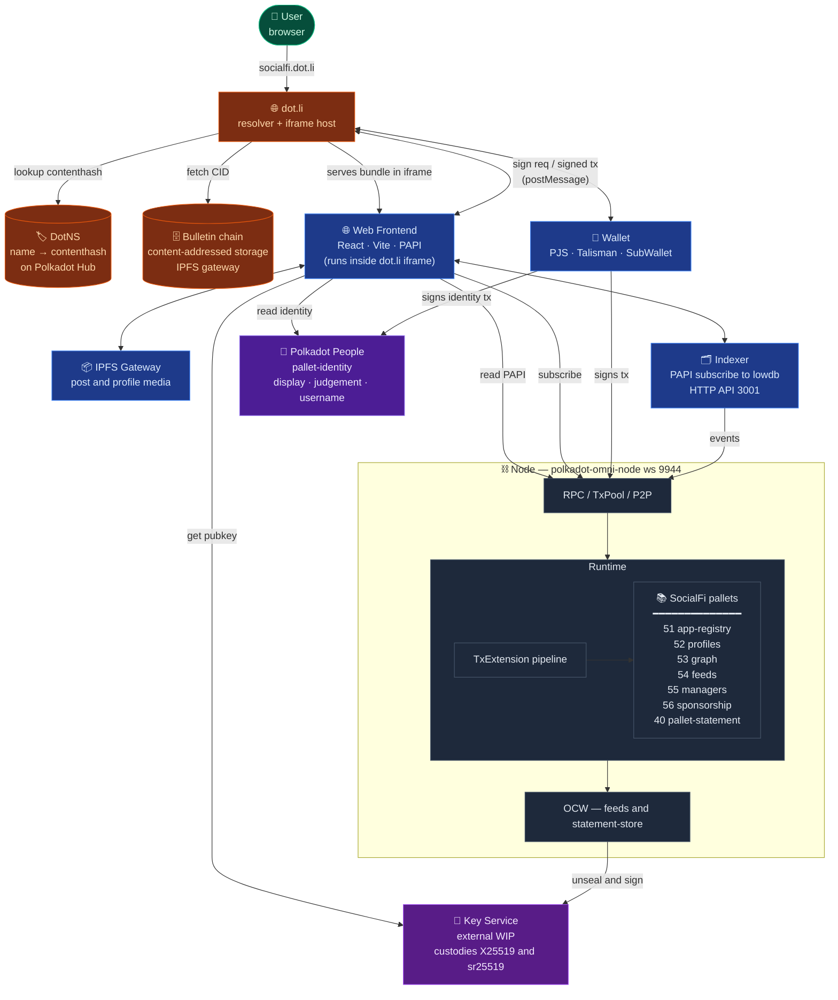

  <picture>
    <source media="(prefers-color-scheme: dark)" srcset="docs/assets/logo-dark.png" />
    <source media="(prefers-color-scheme: light)" srcset="docs/assets/logo-light.png" />
    
  </picture>

# Polkadot Stack Template

A SocialFi reference implementation on Polkadot. Profiles, posts with public/obfuscated/private visibility, follows, a permissionless app registry, delegated managers, sponsored transactions, and real-time notifications via the Substrate Statement Store — all on a single parachain runtime.

**Live deployment**: [socialfi.dot.li](https://socialfi.dot.li) — served through DotNS + Bulletin Chain on Paseo.

**Path**: Substrate pallets (backend) + static web app (frontend). Deployed end-to-end on Paseo via Bulletin Chain + DotNS.

## Architecture at a Glance

**Key dataflows**

- **Delivery path (how the app reaches the user)**: The user opens `https://socialfi.dot.li`. **dot.li** looks the name up on **DotNS** (running on Polkadot Hub TestNet) and gets the `contenthash` pointing at the latest bundle CID. It then fetches that CID from **Bulletin chain's IPFS-compatible gateway** (`paseo-ipfs.polkadot.io`) — *not* a generic gateway like `ipfs.io`, which doesn't know how to talk to Bulletin. dot.li mounts the bundle inside a **sandboxed iframe** in the user's browser and serves it. From there on, the frontend behaves like any other PAPI dapp — the iframe just isolates it from the dot.li host page.
- **Read path**: The frontend pulls live state **straight from the node** over PAPI WS (storage + view functions + statement-store subscriptions) and denormalised tx/event history **from the indexer HTTP API** (`:3001`). IPFS is hit directly from the browser to materialise post/profile media referenced by on-chain CIDs.
- **Write path**: The iframe-embedded frontend doesn't touch the wallet directly — it `postMessage`s the extrinsic up to the **dot.li host**, which owns the connection to the user's wallet (PJS / Talisman / SubWallet / mobile signer). The host asks the wallet to sign, the wallet returns the signed bytes, and the signature comes back into the iframe. The frontend (or the wallet itself) then submits to the node. The node propagates the tx, the runtime dispatches it, and both the frontend (via its own PAPI subscription) and the indexer (via its event watcher) observe the resulting events.
- **Encrypted read path**: Viewer pays `unlock_post` → OCW reads `PendingUnlocks` and **calls the external Key Service** over HTTP. The service custodies the X25519 keypair, opens the capsule, re-seals the content key for the viewer, and signs the delivery payload. OCW submits `deliver_unlock_unsigned` → viewer polls `Unlocks` and decrypts locally. The in-repo `dev_key.rs` is a dev-only stub that inlines the key inside the collator; production moves it behind the Key Service.
- **Sponsored transaction**: `ChargeSponsored.validate` detects a funded sponsor for the signer → `prepare` debits the pot and tops up the beneficiary → native `ChargeTransactionPayment` withdraws the fee (net zero on the beneficiary).
- **Real-time notification**: Pallet emits a statement → `NotificationStatementSubmitter` forwards to `pallet-statement` → OCW attaches `Proof::OnChain` → gossip → frontend `@polkadot-apps/statement-store` subscription updates the bell.

For the four sequence diagrams (runtime composition, notifications, encrypted posts, topic contract) see [`docs/FLOWS.md`](docs/FLOWS.md).

## Commands

Every day-to-day operation is exposed through `make`. Run `make help`
for the live list; the targets below are what the repo ships with.

### Run the stack

| Target            | What it does                                                  |
|-------------------|---------------------------------------------------------------|
| `make node`       | Start the Substrate dev node with full logs                   |
| `make node-quiet` | Same node, with the noisy consensus / idle logs filtered out  |
| `make frontend`   | Start the React frontend (Vite dev server)                    |
| `make indexer`    | Start the event indexer + HTTP API on `:3001`                 |

Each one runs in its own terminal. Typical local flow: `make node` →
`make indexer` → `make frontend`.

### Deploy

| Target                    | What it does                                                          |
|---------------------------|-----------------------------------------------------------------------|
| `make tunnel`             | Open an ngrok HTTPS tunnel against the node WS port (`9944`)          |
| `make deploy-with-tunnel` | Full local DotNS deploy — build, IPFS CAR, Bulletin upload, contenthash (basename: `socialfi`) |
| `make deploy-frontend`    | Legacy path — upload the built frontend to IPFS via `w3cli`           |

The deploy flow assumes `make tunnel` is already running in another
terminal so the published bundle can reach your local node through
the ngrok URL. `make deploy-with-tunnel` is fully self-contained and
does not touch GitHub Actions.

## What works

- **Six custom pallets** composed in a single runtime: `social-app-registry` (51), `social-profiles` (52), `social-graph` (53), `social-feeds` (54), `social-managers` (55), `sponsorship` (56), wired alongside `pallet-statement` (40).
- **Profiles** with IPFS-stored metadata, refundable 10 UNIT bond, editable display/bio/links, optional Polkadot People identity verification.
- **Feed** with `Public` / `Obfuscated` / `Private` visibility. Public posts are readable by anyone; non-public ones are encrypted client-side with XChaCha20-Poly1305 and only decrypt after on-chain `unlock_post` + Key Service delivery.
- **Social graph** with configurable follow fee paid from follower to target, native follower/following counters.
- **App registry** with its own 10 UNIT bond; posts can be scoped to an app and moderated by its owner.
- **Managers**: delegation with scoped authorizations (`post` / `follow` / `update profile`), optional expiration, panic revoke.
- **Sponsorship**: `ChargeSponsored` transaction extension re-routes the fee to a funded sponsor pot — enables gasless onboarding without precious tokens.
- **Live notifications** via Statement Store gossip. No polling, no centralized indexer in the notification path.
- **Frontend (web)**: React + Vite + PAPI, dark/light theme, wallet integration (Polkadot.js / Talisman / SubWallet / Polkadot Host), composer for all post visibilities, unlock flow end-to-end.
- **CLI** (`cli/`, Rust + subxt) covers the same extrinsics for scripting.
- **Indexer** (`indexer/`, lowdb) exposes denormalized tx/event history over HTTP for the transactions page.
- **Deploy** to Paseo via Bulletin Chain + DotNS — reachable at [socialfi.dot.li](https://socialfi.dot.li). `make deploy-with-tunnel` runs the whole pipeline from a clean tree.

## What doesn't (yet)

- **Key Service is a dev stub.** `blockchain/pallets/social-feeds/src/dev_key.rs` hardcodes the X25519 secret — anyone with the source can decrypt every capsule. Production needs an external Key Service (TEE / DKG / threshold) plus `author_insertKey` for the sr25519 signing identity. The capsule + delivery pipeline is already wired to talk to an external service; only the key custody is hand-wavy.
- **Indexer runs single-node lowdb.** Fine for local dev and demo. Not horizontally scalable, not durable past a process restart.
- **Runtime integration tests are thin.** `blockchain/runtime/src/tests.rs` covers the most important paths but isn't exhaustive; per-pallet unit tests carry most of the weight.
- **Post encryption keys aren't recoverable across tabs.** The viewer's ephemeral `buyer_sk` lives in `sessionStorage`; closing the tab before OCW delivery forces a re-unlock from another account. Acceptable for a demo, not for a product.
- **Statement Store allowance is set conservatively.** Heavy notification traffic from a single account will trip the per-account budget; the pallet logs a reject but the UI has no surface for it.

## Known limitations & design compromises

- **Key custody is a compile-time constant.** Moving it out of the collator is the single biggest production blocker (see above). Design is ready; infra is not.
- **PAPI vs subxt split.** The frontend uses PAPI; the CLI uses subxt. Don't mix them — descriptor regeneration (`cd web && pnpm exec papi update && pnpm exec papi`) is required after any storage/call change.
- **`blockchain/chain_spec.json` is generated** and gitignored. Each environment rebuilds it.
- **Dev accounts (Alice / Bob / Charlie) are public Substrate well-known keys** — treat them as demo credentials, never as secrets.

## Getting started

- [`docs/FLOWS.md`](docs/FLOWS.md) — sequence diagrams for the non-trivial flows

## Key versions

| Component | Version |
|---|---|
| polkadot-sdk | stable2512-3 (umbrella crate v2512.3.3) |
| polkadot / polkadot-omni-node | v1.21.3 |
| chain-spec-builder | v17.0.0 |
| zombienet | 1.3.x |
| Rust | stable (pinned via `rust-toolchain.toml`) |
| Node.js | 22.x LTS |

## License

MIT. See [LICENSE](LICENSE).
