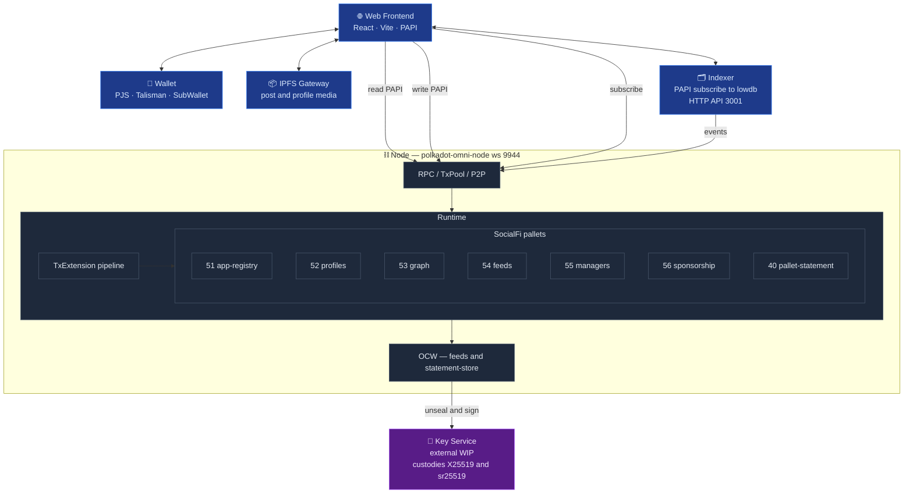

  <picture>
    <source media="(prefers-color-scheme: dark)" srcset="docs/assets/logo-dark.png" />
    <source media="(prefers-color-scheme: light)" srcset="docs/assets/logo-light.png" />
    
  </picture>

# Polkadot Stack Template

A SocialFi reference implementation on Polkadot. Profiles, posts with public/obfuscated/private visibility, follows, a permissionless app registry, delegated managers, sponsored transactions, and real-time notifications via the Substrate Statement Store — all on a single parachain runtime.

## Architecture at a Glance

**Key dataflows**

- **Read path**: The frontend pulls live state **straight from the node** over PAPI WS (storage + view functions + statement-store subscriptions) and denormalised tx/event history **from the indexer HTTP API** (`:3001`). IPFS is hit directly from the browser to materialise post/profile media referenced by on-chain CIDs.
- **Write path**: The frontend asks the **wallet** (PJS / Talisman / SubWallet) to sign the extrinsic; the wallet returns the signed bytes and the **frontend submits them to the node** via PAPI. The node propagates the tx, the runtime dispatches it, and both the frontend (via its own PAPI subscription) and the indexer (via its event watcher) observe the resulting events.
- **Encrypted read path**: Viewer pays `unlock_post` → OCW reads `PendingUnlocks` and **calls the external Key Service** over HTTP. The service custodies the X25519 keypair, opens the capsule, re-seals the content key for the viewer, and signs the delivery payload. OCW submits `deliver_unlock_unsigned` → viewer polls `Unlocks` and decrypts locally. The in-repo `dev_key.rs` is a dev-only stub that inlines the key inside the collator; production moves it behind the Key Service.
- **Sponsored transaction**: `ChargeSponsored.validate` detects a funded sponsor for the signer → `prepare` debits the pot and tops up the beneficiary → native `ChargeTransactionPayment` withdraws the fee (net zero on the beneficiary).
- **Real-time notification**: Pallet emits a statement → `NotificationStatementSubmitter` forwards to `pallet-statement` → OCW attaches `Proof::OnChain` → gossip → frontend `@polkadot-apps/statement-store` subscription updates the bell.

## Commands

Every day-to-day operation is exposed through `make`. Run `make help`
for the live list; the targets below are what the repo ships with.

### Run the stack

| Target            | What it does                                                  |
|-------------------|---------------------------------------------------------------|
| `make node`       | Start the Substrate dev node with full logs                   |
| `make node-quiet` | Same node, with the noisy consensus / idle logs filtered out  |
| `make frontend`   | Start the React frontend (Vite dev server)                    |
| `make indexer`    | Start the event indexer + HTTP API on `:3001`                 |

Each one runs in its own terminal. Typical local flow: `make node` →
`make indexer` → `make frontend`.

### Deploy

| Target                    | What it does                                                          |
|---------------------------|-----------------------------------------------------------------------|
| `make tunnel`             | Open an ngrok HTTPS tunnel against the node WS port (`9944`)          |
| `make deploy-with-tunnel` | Full local DotNS deploy — build, IPFS CAR, Bulletin upload, contenthash (basename: `socialfi`) |
| `make deploy-frontend`    | Legacy path — upload the built frontend to IPFS via `w3cli`           |

The deploy flow assumes `make tunnel` is already running in another
terminal so the published bundle can reach your local node through
the ngrok URL. `make deploy-with-tunnel` is fully self-contained and
does not touch GitHub Actions.

## Documentation

- [docs/ARCHITECTURE_OVERVIEW.md](docs/ARCHITECTURE_OVERVIEW.md) — Whole-stack walkthrough
- [docs/NOTIFICATIONS_FLOW.md](docs/NOTIFICATIONS_FLOW.md) — End-to-end notification sequence
- [docs/NOTIFICATIONS_TOPICS.md](docs/NOTIFICATIONS_TOPICS.md) — Topic + payload contract
- [docs/ENCRYPTED_POSTS_WORKFLOW.md](docs/ENCRYPTED_POSTS_WORKFLOW.md) — Encrypted posts deep dive
- [docs/DEPLOYMENT.md](docs/DEPLOYMENT.md) — Deployment guide
- [docs/INSTALL.md](docs/INSTALL.md) — Local setup

## Key Versions

| Component | Version |
|---|---|
| polkadot-sdk | stable2512-3 (umbrella crate v2512.3.3) |
| polkadot / polkadot-omni-node | v1.21.3 |
| chain-spec-builder | v17.0.0 |
| zombienet | 1.3.x |
| Rust | stable (pinned via `rust-toolchain.toml`) |
| Node.js | 22.x LTS |

## License

MIT. See [LICENSE](LICENSE).
