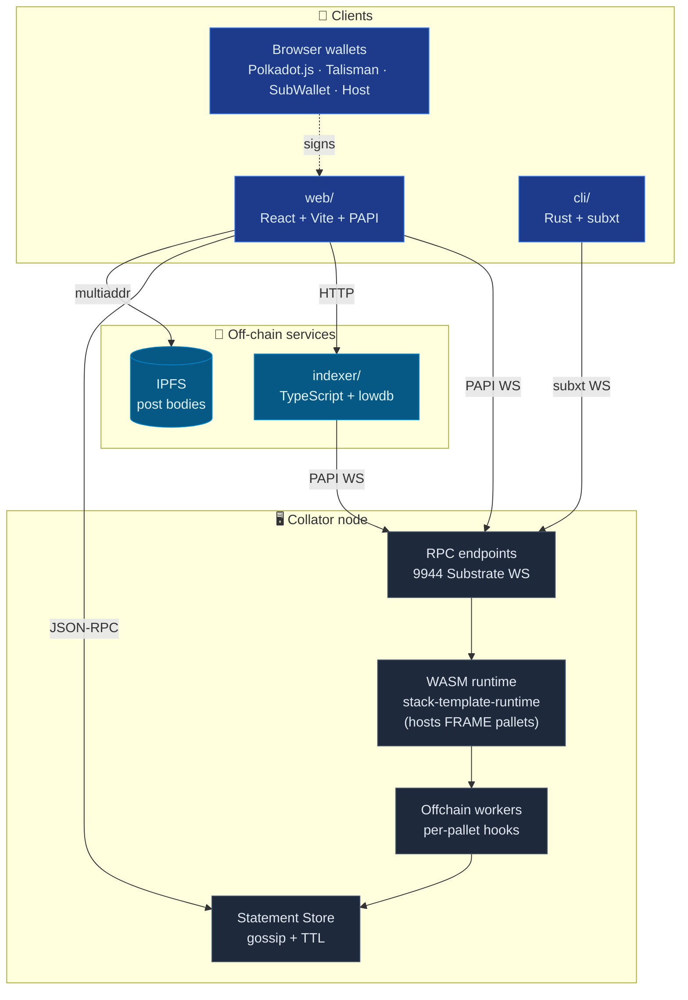
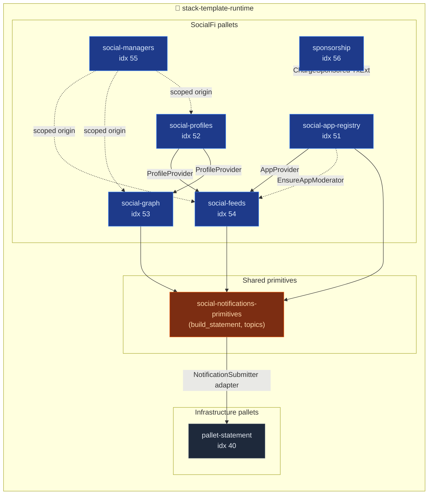
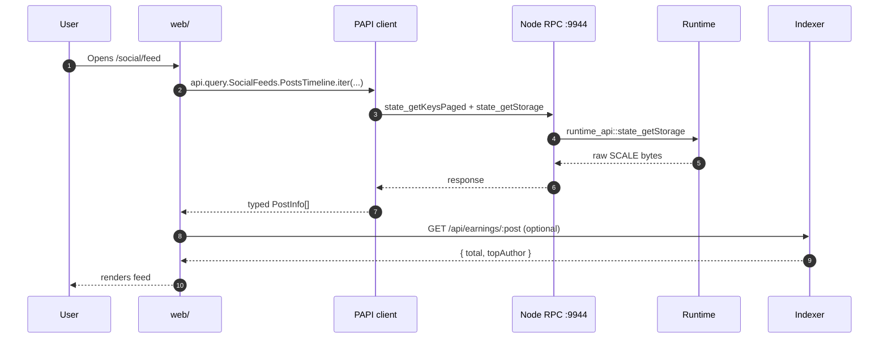
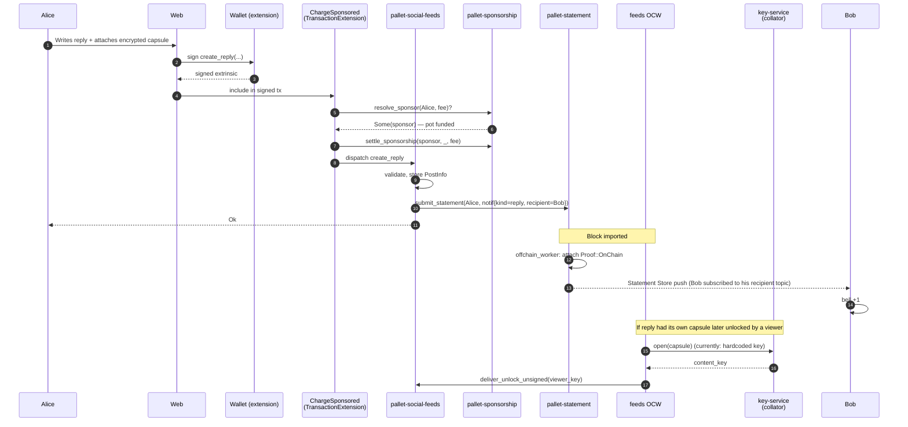
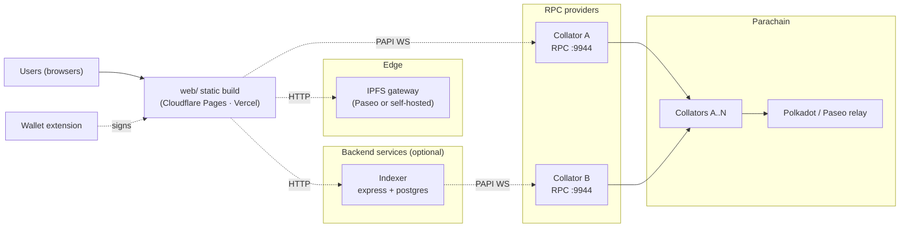

  <picture>
    <source media="(prefers-color-scheme: dark)" srcset="./assets/logo-dark.png" />
    <source media="(prefers-color-scheme: light)" srcset="./assets/logo-light.png" />
    
  </picture>

# Architecture Overview

A whole-stack view of the Polkadot Stack Template: pallets, runtime,
collator, clients, indexer, wallets, and the offchain workers that
glue privacy features together.

The template is a **SocialFi reference** for the Polkadot tech stack:
profiles, posts, follows, apps, sponsored transactions, delegated
managers, encrypted-post delivery, and real-time notifications.

## 10-second mental model

- The **chain** is a parachain runtime that embeds the FRAME social
  pallets plus `pallet-statement` and runs inside a **collator** node.
- Anything that needs trustless consensus lives **on-chain**: profile
  registrations, posts, follow edges, app registry entries, fee pots,
  encrypted capsules, moderation records.
- Anything that would be wasteful to put in a block lives **off-chain**:
  full post content (IPFS), real-time notifications (Statement Store),
  presence/unlock delivery (offchain worker + statement gossip),
  denormalised feed views (local indexer).
- Clients (browser dApp, Rust CLI) talk to the chain via RPC — PAPI
  for Substrate extrinsics from the browser, subxt from the CLI.

## Top-down component map

High-level flow — clients, off-chain services, and the collator. The
pallets live inside the runtime; they get their own zoom-in below.

### Pallet zoom-in

The runtime `construct_runtime!` composition. Social pallets sit
around the shared primitives (`social-notifications-primitives`)
and push notifications through `pallet-statement`.

---

## Layer by layer

### 1. Pallets (on-chain business logic)

Each pallet is a single-responsibility FRAME module that owns a
storage domain and exposes extrinsics.

| Pallet | Role | Key extrinsics |
|---|---|---|
| `social-app-registry` | Permissionless registry of "apps" (front-ends) that consume the shared protocol. Each app locks a bond. | `register_app`, `deregister_app`, `act_as_moderator` |
| `social-profiles` | Global profile registry (1 per account). Holds metadata CID + per-account follow fee. | `create_profile`, `update_metadata`, `set_follow_fee`, `delete_profile` |
| `social-graph` | Follow / unfollow edges between accounts. Fee per-edge goes to the followed user. | `follow`, `unfollow` |
| `social-feeds` | Posts, replies, visibility (public/obfuscated/private), moderation, encrypted-post delivery. | `create_post`, `create_reply`, `unlock_post`, `redact_post`, `set_key_service`, `deliver_unlock_unsigned` |
| `social-managers` | Scoped delegation (Lens-style): let another account act on your behalf for a subset of scopes. | `add_manager`, `remove_manager`, `act_as_manager` |
| `sponsorship` | Sponsor pots + `ChargeSponsored` TransactionExtension that pays fees for pre-authorised beneficiaries. | `register_beneficiary`, `top_up`, `withdraw`, (+ signed-ext hooks) |
| `pallet-statement` | Parity's Statement Store pallet. Its OCW turns on-chain `NewStatement` events into gossiped statements. | (no extrinsics; driven by events) |

All pallets live in `blockchain/pallets/`. Shared helpers (the
notifications crate) live in `blockchain/primitives/`.

### 2. Runtime (the WASM blob)

`blockchain/runtime/` composes the pallets into a single
`construct_runtime!`, wires pallet Configs, defines runtime APIs
(including `ValidateStatement`) and emits the WASM blob the collator
executes. Pallet indices are pinned:

| Index | Pallet |
|---|---|
| 40 | `pallet-statement` |
| 51 | `social-app-registry` |
| 52 | `social-profiles` |
| 53 | `social-graph` |
| 54 | `social-feeds` |
| 55 | `social-managers` |
| 56 | `sponsorship` |

The runtime also owns cross-pallet adapters — e.g.
`NotificationStatementSubmitter` bridges social pallets to
`pallet-statement` without making each pallet depend on statement-store
directly.

### 3. Offchain workers (OCW)

OCWs are runtime functions that run **after each imported block, off
the consensus path**. They can call host functions the regular
dispatch path can't — HTTP, local storage, signing. This project runs
two meaningful OCWs today:

- **`pallet-statement` OCW** — scans `System::events()` for
  `NewStatement`, attaches `Proof::OnChain`, hands the statement to
  the Statement Store host function. Notifications (replies, follows,
  new-app broadcasts) ride on this.
- **`social-feeds` OCW** (`src/offchain.rs`) — for encrypted posts,
  reads pending unlocks, opens the capsule with the key-service
  secret, re-seals to the viewer's ephemeral public key, submits a
  signed `deliver_unlock_unsigned`. Key management is a known weak
  point today; see [`KEY_MANAGEMENT.md`](./KEY_MANAGEMENT.md) for the
  migration plan.

### 4. Collator node

The bin produced by `polkadot-parachain`-compatible wrapper logic
(Docker image built from `docker/Dockerfile.node`). Exposes:

- **9944** — Substrate JSON-RPC over WebSocket. PAPI, subxt, and the
  Statement Store subscription hit this.
- **30333** — libp2p peer port.

Statement Store gossip also flows through libp2p, separately from
block gossip.

### 5. Statement Store

An off-chain, signed, TTL-bounded pub/sub network piggy-backing on
libp2p. Different from block storage in three ways:

1. Statements **never enter a block**. They gossip between nodes.
2. Each statement has up to 4 topics — we use two (app namespace +
   routing key) and use a JSON payload for max cross-language
   portability.
3. Clients subscribe via `statement_subscribeStatement(TopicFilter)`
   and receive WebSocket pushes the moment a matching statement
   arrives.

See [`NOTIFICATIONS_ARCHITECTURE.md`](./NOTIFICATIONS_ARCHITECTURE.md)
for the specific wiring and [`NOTIFICATIONS_TOPICS.md`](./NOTIFICATIONS_TOPICS.md)
for the exact topic layout.

### 6. Off-chain services

- **`indexer/`** — tiny TypeScript service (Express + lowdb) that
  subscribes to the chain via PAPI, denormalises transfers and pallet
  events into a JSON file, and exposes `/api/events`,
  `/api/txs-by-address`, `/api/earnings/:post_id` to the frontend.
  Non-authoritative: the chain remains the source of truth; the
  indexer is pure query acceleration. Listens on localhost only.
- **IPFS** — storage for post bodies and profile metadata. The chain
  stores only CIDs; the frontend pins/reads real content from IPFS.

### 7. Clients

- **`web/`** — React 18 + Vite + Tailwind + PAPI + zustand. Main
  surface for end users. Connects wallets, renders the feed, submits
  extrinsics, subscribes to notifications.
- **`cli/`** — Rust binary built on subxt + clap. Scriptable
  access to the Substrate side (chain info, Statement Store submit /
  dump). Used by the smoke test scripts.

### 8. Wallets

Three entry points are supported:

| Wallet | Transport | Where it runs |
|---|---|---|
| Polkadot.js / SubWallet / Talisman | Browser extension API | Browser |
| Polkadot Host | `@novasamatech/product-sdk` | Inside a container (desktop/mobile) |
| Dev-mode seeds | HDKD in-memory | Browser (dev only) |

The frontend normalises all three behind a single `WalletAccount`
store entry and lets the user switch per-tab.

### 9. Notifications

A real-time bell in the header that pushes events without polling.
See the dedicated docs:

- [`NOTIFICATIONS_ARCHITECTURE.md`](./NOTIFICATIONS_ARCHITECTURE.md)
  — component map.
- [`NOTIFICATIONS_FLOW.md`](./NOTIFICATIONS_FLOW.md) — end-to-end
  sequence.
- [`NOTIFICATIONS_TOPICS.md`](./NOTIFICATIONS_TOPICS.md) — topic +
  payload contract.

---

## Typical request paths

### Reading the home feed

Notes:

- Reads go directly to the chain for canonical data; the indexer is
  only consulted when its denormalised view is useful (earnings
  rollups, timeline-by-address).
- PAPI generates typed descriptors from the runtime metadata
  (checked-in under `web/.papi/`), so every storage read is type-
  safe at the browser level.

### Posting an encrypted reply with sponsored fees

Three things to notice:

1. **Alice pays nothing in fees** — `ChargeSponsored` redirects the
   fee to a sponsor pot before `ChargeTransactionPayment` ever
   charges her. See [`SPONSORSHIP.md`](./SPONSORSHIP.md) if/when that
   doc exists.
2. **Notifications are automatic** — no pallet emits a statement
   directly; `build_statement` → `submit_statement` → OCW gossip.
3. **Encryption key handling is the known soft spot** — see the
   bottom of this doc.

---

## Deployment topology

A realistic deploy looks like this:

The template ships a docker-compose for a single-node dev cluster
(`docker-compose.yml`) and zombienet configs under `scripts/` for
multi-collator testing. Neither reflects a production deploy — that
would use a relay chain + multiple collators + RPC load balancers +
observability stack — but every moving part you'd need is already in
the source.

---

## Source-of-truth cheat sheet

If you ever get lost about **which layer owns what**:

| Data | Source of truth | Denormalised copy |
|---|---|---|
| Account balances | pallet-balances storage | — |
| Profile metadata CID | pallet-social-profiles storage | — |
| Post bodies | IPFS | web PAPI cache |
| Post metadata | pallet-social-feeds storage | indexer (`/api/events`) |
| Follow edges | pallet-social-graph storage | — |
| Notifications | Statement Store (transient) | browser state (local) |
| Encrypted post content key | off-chain (custodial key service, TBD) | — |

The rule: **if you can read it from the chain, read it from the
chain**. The indexer exists to make specific queries cheaper, never
to replace the chain as the authoritative source.

---

## Known rough edges

- **Encryption key management** — the X25519 secret used by the
  feeds OCW to decrypt capsules is currently a compile-time constant
  (`pallet-social-feeds::dev_key::DEV_SEED`). Anyone with access to
  the WASM or the repo can decrypt every obfuscated/private post.
  Migration plan: load the key from the collator's offchain local
  storage (keystore-backed), with dev mode falling back to the
  existing constant behind a feature flag.
- **Indexer is single-node** — fine for dev, needs to move to
  Postgres + a proper job runner for production.
- **Sponsorship fee calculation** ignores `proof_size` and length
  fees (documented MVP limitation in `extension.rs`). In practice
  sponsors over-approve budget; revisit when a real fee model is
  needed.
- **Deployment addresses are a JSON file** — racy when multiple
  environments deploy in parallel.

---

## Where to go next

- [`INSTALL.md`](./INSTALL.md) — local setup.
- [`TOOLS.md`](./TOOLS.md) — tooling reference.
- [`DEPLOYMENT.md`](./DEPLOYMENT.md) — production-lite deployment.
- [`ENCRYPTED_POSTS.md`](./ENCRYPTED_POSTS.md) — full crypto design
  of obfuscated/private posts.
- [`ENCRYPTED_POSTS_WORKFLOW.md`](./ENCRYPTED_POSTS_WORKFLOW.md) —
  step-by-step of a single encrypted unlock.
- [`NOTIFICATIONS_ARCHITECTURE.md`](./NOTIFICATIONS_ARCHITECTURE.md)
  + [`NOTIFICATIONS_FLOW.md`](./NOTIFICATIONS_FLOW.md)
  + [`NOTIFICATIONS_TOPICS.md`](./NOTIFICATIONS_TOPICS.md) — real-
  time notifications.
