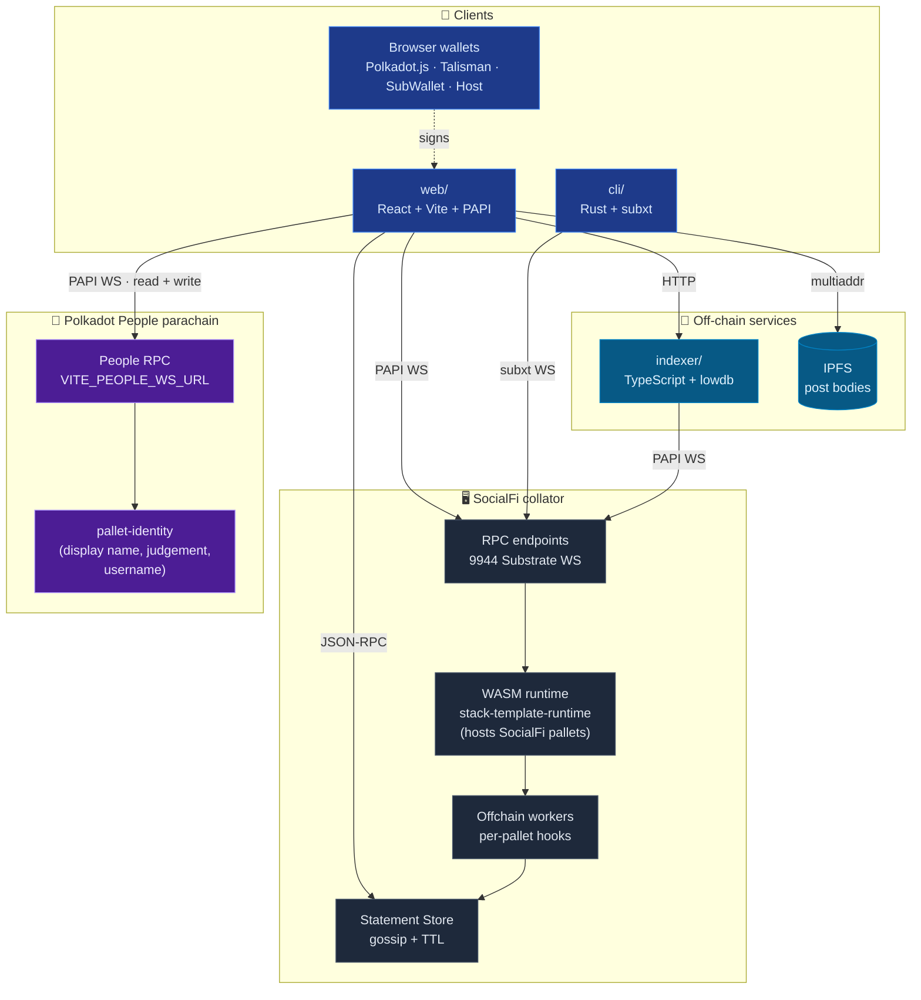
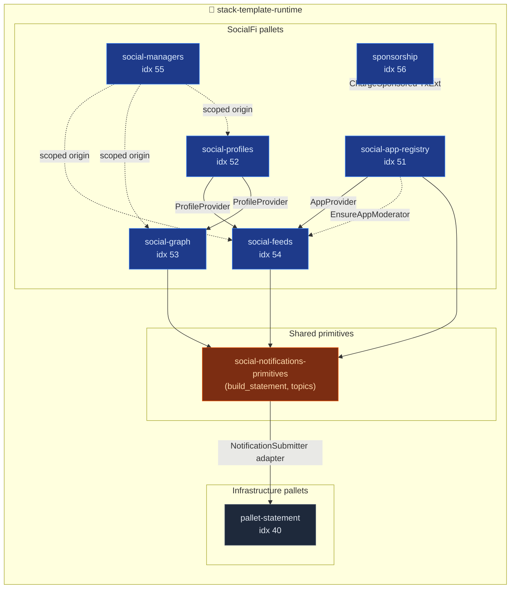
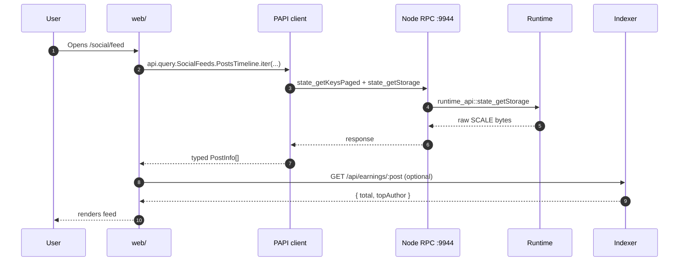
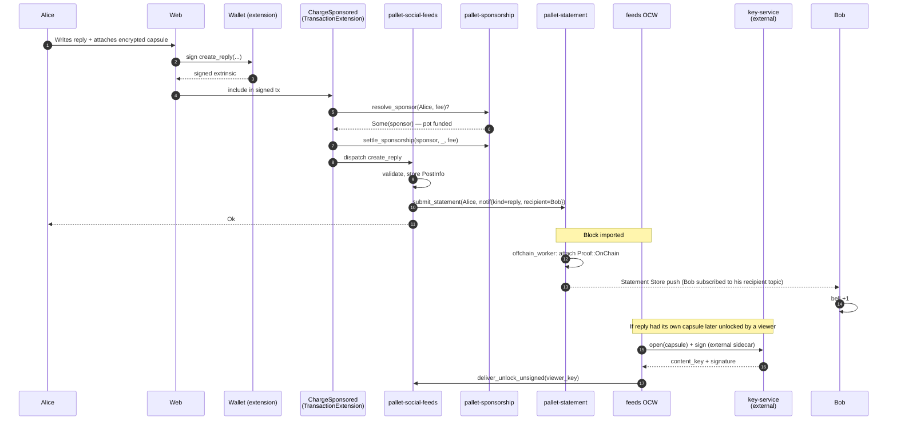
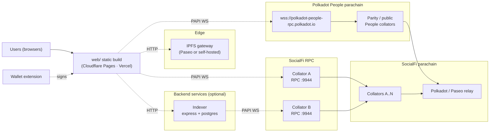

  <picture>
    <source media="(prefers-color-scheme: dark)" srcset="./assets/logo-dark.png" />
    <source media="(prefers-color-scheme: light)" srcset="./assets/logo-light.png" />
    
  </picture>

# Architecture Overview

Canonical deep-dive for the whole stack. Assumes you have seen the root `README.md` diagram; this doc explains **how the pieces talk, what lives where, and which invariants they uphold**.

## 10-second mental model

- **Chain**: parachain runtime embedding the FRAME social pallets plus `pallet-statement`, run inside a **collator**.
- **On-chain**: profiles, posts, follow edges, app registry, fee pots, encrypted capsules, moderation records.
- **Off-chain**: post bodies (IPFS), real-time notifications (Statement Store gossip), capsule unlocks (OCW + external key service), denormalised views (local indexer).
- Clients talk RPC: PAPI from the browser, subxt from the CLI.

## Top-down component map

The frontend opens **two PAPI connections in parallel**: one to this chain for SocialFi data, one to **Polkadot People** for identity. The same sr25519 keypair signs against either chain.

### Pallet zoom-in

Pallet indices above are pinned in `construct_runtime!` and not re-listed elsewhere in this doc.

---

## Layer by layer

### 1. Pallets (on-chain business logic)

Each pallet is a single-responsibility FRAME module owning a storage domain; extrinsic lists live in each pallet's `lib.rs` under `blockchain/pallets/`. Cross-pallet wiring (per diagram): `social-feeds` consumes `AppProvider` from the registry and `ProfileProvider` from profiles; `social-managers` injects a synthetic scoped origin into feeds/graph/profiles; `sponsorship` attaches as a `TransactionExtension` over all social extrinsics. Shared notification helpers live in `blockchain/primitives/social-notifications/`.

### 2. Runtime (the WASM blob)

`blockchain/runtime/` composes pallets into `construct_runtime!`, wires Configs, defines runtime APIs (including `ValidateStatement`), and emits the WASM the collator executes. It also owns cross-pallet adapters — notably `NotificationStatementSubmitter`, which bridges social pallets to `pallet-statement` so no social pallet depends on statement-store directly.

### 3. Offchain workers (OCW)

OCWs run **after each imported block, off the consensus path**, and can call host functions unavailable in dispatch (HTTP, local storage, signing). Two run today:

- **`pallet-statement` OCW** — scans events for `NewStatement`, attaches `Proof::OnChain`, hands off to the Statement Store.
- **`social-feeds` OCW** (`src/offchain.rs`) — processes pending capsule unlocks by calling an **external Key Service** sidecar that custodies the X25519 keypair; the service opens the capsule, re-seals the content key to the viewer's ephemeral public key, and signs. The OCW then submits `deliver_unlock_unsigned`. In-repo code ships a dev stub (`dev_key.rs`) that inlines this into the collator; production moves it behind the external service.

### 4. Collator node

Polkadot-parachain-compatible binary, built by `docker/Dockerfile.node`. Exposes **9944** (Substrate JSON-RPC over WS — PAPI, subxt, Statement Store) and **30333** (libp2p). Statement Store gossip rides libp2p separately from block gossip.

### 5. Statement Store

Off-chain, signed, TTL-bounded pub/sub riding libp2p. Statements **never enter a block** — they gossip between nodes. Each carries up to 4 topics (we use two: app namespace + routing key) plus a JSON payload for cross-language portability. Clients subscribe via `statement_subscribeStatement(TopicFilter)` for WebSocket push.

### 6. Off-chain services

- **`indexer/`** — TypeScript (Express + lowdb), subscribes via PAPI, denormalises events into JSON, exposes `/api/events`, `/api/txs-by-address`, `/api/earnings/:post_id`. Non-authoritative query acceleration; localhost-only.
- **IPFS** — stores post bodies and profile metadata; the chain holds only CIDs.

### 7. Clients

- **`web/`** — React 18 + Vite + Tailwind + PAPI + zustand. Connects wallets, renders the feed, submits extrinsics, subscribes to notifications.
- **`cli/`** — Rust binary on subxt + clap. Chain info + Statement Store submit/dump; used by smoke tests.

### 8. Wallets

Three entry points, normalised behind a single `WalletAccount` store entry:

| Wallet | Transport | Where it runs |
|---|---|---|
| Polkadot.js / SubWallet / Talisman | Browser extension API | Browser |
| Polkadot Host | `@novasamatech/product-sdk` | Container (desktop/mobile) |
| Dev-mode seeds | HDKD in-memory | Browser (dev only) |

### 9. Notifications

Real-time header bell, no polling. Design choice: **no social pallet depends on `pallet-statement` directly** — pallets emit through `social-notifications-primitives::build_statement` and the runtime's `NotificationStatementSubmitter` adapter forwards to `pallet-statement`, keeping pallets reusable outside this runtime. Sequence: [`NOTIFICATIONS_FLOW.md`](./NOTIFICATIONS_FLOW.md); topic + payload contract: [`NOTIFICATIONS_TOPICS.md`](./NOTIFICATIONS_TOPICS.md).

### 10. Identity (Polkadot People parachain)

Display names, websites, social handles and registrar judgements live on the **Polkadot People system parachain**, not on this chain — the protocol piggybacks on identity users already hold across Polkadot UIs. The frontend opens a second PAPI connection to `VITE_PEOPLE_WS_URL`; `useIdentity(address)` reads `Identity.IdentityOf` and surfaces a three-state badge (`verified` / `pending` / `none`). `<IdentityPanel />` submits `set_identity` / `request_judgement` / `clear_identity` directly to People using the same sr25519 keypair (user needs DOT on People for the deposit). `pallet-social-profiles` remains source of truth for SocialFi-specific data (metadata CID + follow fee). Identity is universal; profile is app-specific.

---

## Typical request paths

### Reading the home feed

Reads hit the chain directly for canonical data; the indexer is only consulted for denormalised views (earnings rollups, timeline-by-address). PAPI generates typed descriptors from runtime metadata (`web/.papi/`), so every storage read is type-safe at the browser.

### Posting an encrypted reply with sponsored fees

Alice pays nothing: `ChargeSponsored` redirects the fee to a sponsor pot before `ChargeTransactionPayment` ever charges her. Notifications are emitted indirectly via `build_statement` — no pallet touches statement-store by hand. The Key Service sidecar is the same decision as §3: capsule decryption does not live in the collator process.

---

## Deployment topology

The repo ships single-node docker-compose and zombienet configs for multi-collator testing — neither is a production topology. Real deploys add a relay chain, multiple collators, RPC load balancers and observability, but every moving part is already in source.

---

## Known rough edges

- **Encryption key management** — the X25519 secret used by the feeds OCW is a compile-time constant (`dev_key::DEV_SEED`); anyone with the WASM can decrypt every capsule. Migration plan: keystore-backed loading, dev falls back behind a feature flag. The external Key Service sidecar in the diagrams is the target endpoint.
- **Indexer is single-node** — fine for dev, needs Postgres + a job runner for production.
- **Sponsorship fee calculation** ignores `proof_size` and length fees (MVP limitation, documented in `extension.rs`).
- **Deployment addresses in a JSON file** — racy under parallel env deploys.

---

## Where to go next

- [`INSTALL.md`](./INSTALL.md) — local setup.
- [`DEPLOYMENT.md`](./DEPLOYMENT.md) — production-lite deployment.
- [`ENCRYPTED_POSTS_WORKFLOW.md`](./ENCRYPTED_POSTS_WORKFLOW.md) — single encrypted unlock, end to end.
- [`NOTIFICATIONS_FLOW.md`](./NOTIFICATIONS_FLOW.md) — notification sequence.
- [`NOTIFICATIONS_TOPICS.md`](./NOTIFICATIONS_TOPICS.md) — topic + payload contract.
