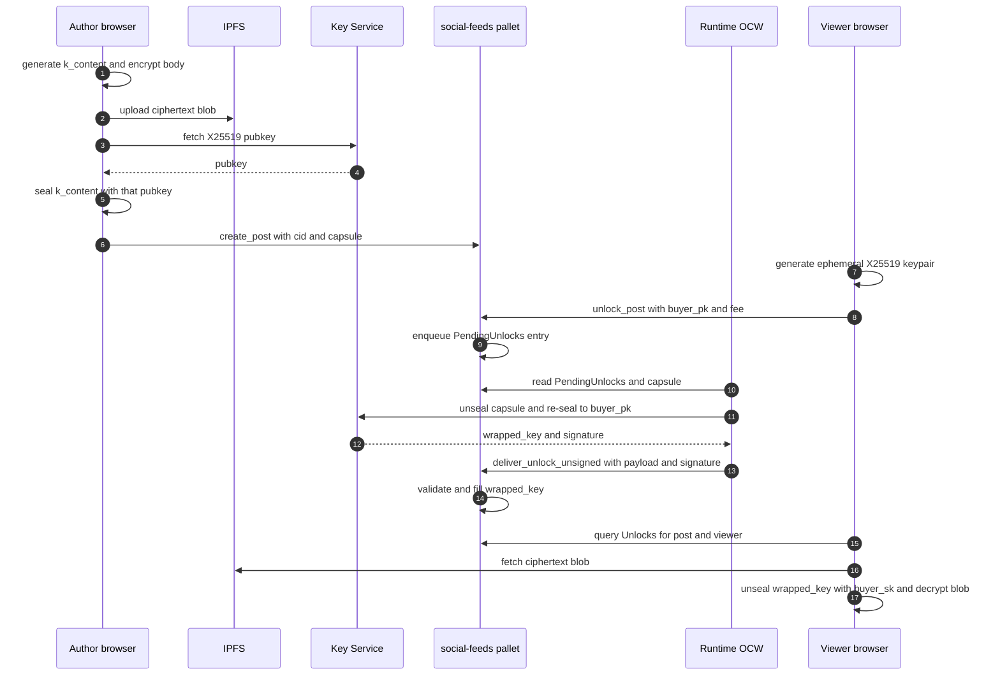

  <picture>
    <source media="(prefers-color-scheme: dark)" srcset="./assets/logo-dark.png" />
    <source media="(prefers-color-scheme: light)" srcset="./assets/logo-light.png" />
    
  </picture>

# Encrypted Posts — End-to-End Workflow

This document traces what happens, and **where**, when an author publishes an
encrypted post and a paying viewer decrypts it. It is a map, not a code
listing: every phase links to the Rust / TypeScript files that implement it.

The design goals are simple:

- **Deterministic**: the same capsule always unwraps to the same content key.
- **Viewer-pays**: the viewer is charged by the pallet before the key is
  delivered; the author sets the price.
- **Capsule-based delivery**: the content key is never handed out verbatim.
  It is sealed to the Key Service on publish, then re-sealed to each viewer
  on unlock.

Three keys do all the work:

| Key | Algorithm | Purpose | Custodian |
|---|---|---|---|
| `k_content` | XChaCha20-Poly1305 (32 B) | Encrypts the post body before upload to IPFS | Author at publish time, then zeroized |
| Key Service X25519 keypair | `crypto_box_seal` (sealed box) | Wraps `k_content` into the on-chain `capsule`; the secret unseals it inside the OCW | Key Service (today: compile-time stub, see below) |
| Key Service sr25519 identity | `sr25519` | Signs `DeliverUnlockPayload` so `validate_unsigned` accepts the delivery | Node keystore under `KeyTypeId(*b"p2dc")` |

> The X25519 secret is currently a compile-time dev stub in
> [`blockchain/pallets/social-feeds/src/dev_key.rs`](../blockchain/pallets/social-feeds/src/dev_key.rs).
> The production target is an external **Key Service** process — see
> [`README.md`](../README.md) and
> [`docs/ARCHITECTURE_OVERVIEW.md`](./ARCHITECTURE_OVERVIEW.md) for the
> planned custody model.

---

## Happy-path sequence

---

## Phase 0 — Bootstrap

Before any post exists, two things must be true at genesis:

1. The runtime must know the Key Service's public identity.
2. The node's keystore must hold the matching sr25519 seed so the OCW can
   sign delivery transactions.

The first is set in
[`blockchain/runtime/src/genesis_config_presets.rs`](../blockchain/runtime/src/genesis_config_presets.rs):
`SocialFeedsConfig::key_service` is populated with a `KeyServiceInfo`
containing the sr25519 `account`, the X25519 `encryption_pk`, and a
`version`. Both public keys come from `dev_key.rs`.

The second is primed by
[`scripts/common.sh`](../scripts/common.sh) after the node is up: it reads
the on-chain `SocialFeeds.KeyService.account` and calls `author_insertKey`
with seed `//KeyService` under `KeyTypeId(*b"p2dc")`. From that point on,
`Signer::<T, T::AuthorityId>::any_account()` inside the OCW resolves to the
Key Service account.

Key state and inputs for this phase:

- Genesis: `SocialFeeds::KeyService = Some(KeyServiceInfo { account, encryption_pk, version })`.
- Node flag: `--offchain-worker always` (required — without it the hook
  never fires in solo dev).
- Keystore entry: `p2dc` → sr25519 seed `//KeyService`.
- Module wiring: `pallet_social_feeds::offchain` is compiled into the
  runtime WASM (no `#[cfg(feature = "std")]`), so `offchain_worker` is not a
  no-op.

---

## Phase 1 — Author publishes

The author picks `Obfuscated` or `Private` visibility in the UI, writes the
content, and submits. The browser does all the cryptography locally; the
chain only ever sees ciphertext and an opaque capsule.

The flow:

1. Generate a fresh 32-byte `k_content`.
2. AAD = `BLAKE2b-256(plaintext)`; encrypt the body with
   XChaCha20-Poly1305 using `k_content` and that AAD.
3. Encode the output as `nonce ‖ aad_len ‖ aad ‖ ciphertext+tag` and upload
   it to IPFS, yielding a CID.
4. Build the **capsule** = `crypto_box_seal(k_content, KeyService_encryption_pk)`
   — always 80 bytes (see `SEALED_KEY_LEN`).
5. Zeroize `k_content`.
6. Call `SocialFeeds.create_post` with `{ content: cid, visibility,
   unlock_fee, capsule: Some(80 bytes) }`.

Source of truth:

- Browser crypto: [`web/src/hooks/social/useEncryptedPosts.ts`](../web/src/hooks/social/useEncryptedPosts.ts)
  and [`web/src/utils/postCrypto.ts`](../web/src/utils/postCrypto.ts).
- Submission UI: [`web/src/pages/social/AppDetailPage.tsx`](../web/src/pages/social/AppDetailPage.tsx).
- Pallet validation (non-public posts must carry a capsule of exactly
  `SEALED_KEY_LEN` bytes, and `KeyService` must be configured):
  [`blockchain/pallets/social-feeds/src/lib.rs`](../blockchain/pallets/social-feeds/src/lib.rs)
  (`create_post`).

After the extrinsic is in a block:

- Storage: `Posts[post_id] = { author, content: cid, visibility, unlock_fee, capsule: Some(80 B), .. }`.
- Event: `Event::PostCreated`.

---

## Phase 2 — Viewer requests unlock

A different account opens the post and clicks Unlock. The viewer generates
an **ephemeral** X25519 keypair; only the public key leaves the tab.

1. `generateX25519Keypair()` — fresh per unlock.
2. Stash `buyer_sk` in `sessionStorage` keyed by `post_id` (it must survive
   until the OCW delivery arrives, but not across tab closes).
3. Submit `SocialFeeds.unlock_post(post_id, buyer_pk)`.

The pallet (`unlock_post` in
[`blockchain/pallets/social-feeds/src/lib.rs`](../blockchain/pallets/social-feeds/src/lib.rs))
does the bookkeeping:

- Rejects public posts and duplicate unlocks.
- Transfers `unlock_fee` from viewer to author (skipped if viewer is the
  author).
- Writes `Unlocks[post_id][viewer] = UnlockRecord { buyer_pk, wrapped_key: None, requested_at }`.
- Writes `PendingUnlocks[(post_id, viewer)] = ()` — this is the flag the
  OCW scans.
- Emits `Event::PostUnlocked { post_id, viewer, author, fee_paid }`.

Storage items / extrinsics touched:

- Extrinsic: `SocialFeeds.unlock_post`.
- Storage (new): `Unlocks`, `PendingUnlocks`.
- Frontend state: `buyer_sk` in `sessionStorage`, UI moves to
  `awaiting-key`.

> The frontend uses `postId === null` (not `!postId`) when guarding this
> path, because `BigInt(0)` is falsy and post id 0 is valid.

---

## Phase 3 — OCW delivers the wrapped key

On every block, inside the **runtime WASM**, `offchain_worker` calls
`crate::offchain::run::<T>`. See
[`blockchain/pallets/social-feeds/src/offchain.rs`](../blockchain/pallets/social-feeds/src/offchain.rs)
for the full implementation.

Per-tick behaviour:

1. Short-circuit unless `is_validator()` and `KeyService` is configured.
2. Load the X25519 secret from `dev_key::secret_key()`.
3. Iterate `PendingUnlocks`, capped by `MAX_DELIVERIES_PER_BLOCK`.
4. For each `(post_id, viewer)`: take an off-chain `StorageLock` keyed by
   `(b"feeds-unlock-lock", post_id, viewer)` to keep two consecutive blocks
   from racing on the same entry.
5. Inside the lock, call `try_deliver`:
   - Re-read `Unlocks` and the post; bail if `wrapped_key` already set or
     the capsule is gone.
   - `k_content = sk.unseal(capsule)`.
   - `wrapped_key = buyer_pk.seal(rng, k_content)` with RNG seeded from
     `sp_io::offchain::random_seed()`.
   - Zeroize `k_content`.
   - Build `DeliverUnlockPayload { public, block_number, post_id, viewer, wrapped_key }`,
     sign it via `Signer::<T, T::AuthorityId>::any_account()`, and submit
     `Call::deliver_unlock_unsigned { payload, signature }` as an
     **unsigned transaction with signed payload**. The OCW pays no fees;
     the pallet authenticates via the embedded signature.

On-chain validation in
[`blockchain/pallets/social-feeds/src/lib.rs`](../blockchain/pallets/social-feeds/src/lib.rs)
(`validate_unsigned` / `validate_delivery`) enforces four things:

- **Freshness**: `payload.block_number` within `UnsignedValidityWindow` of
  `now`.
- **Signature**: `SignedPayload::verify::<AuthorityId>(payload, signature)`.
- **Identity**: the recovered signer equals the current on-chain
  `KeyService.account` (this is why phase 0 must keep the keystore and
  genesis aligned).
- **Dedup**: `ValidTransaction::with_tag_prefix("social-feeds-unlock")
  .and_provides((post_id, viewer))` — the txpool drops duplicates.

When `deliver_unlock_unsigned` dispatches, it mutates `Unlocks` to set
`wrapped_key = Some(..)` and removes the `PendingUnlocks` entry.

Storage items / extrinsics touched:

- Read: `PendingUnlocks`, `Unlocks`, `Posts`, `KeyService`.
- Write: `Unlocks.wrapped_key` (filled), `PendingUnlocks` (removed).
- Extrinsic: `deliver_unlock_unsigned` (unsigned, signed payload).
- Event: `Event::UnlockDelivered`.

---

## Phase 4 — Viewer decrypts

The frontend (see
[`web/src/hooks/social/useEncryptedPosts.ts`](../web/src/hooks/social/useEncryptedPosts.ts))
polls `SocialFeeds.Unlocks[post_id][viewer]` — the hook re-runs on every
`blockNumber`, so within 1–2 blocks of OCW delivery `wrapped_key` becomes
`Some`. Rendering lives in
[`web/src/pages/social/AppDetailPage.tsx`](../web/src/pages/social/AppDetailPage.tsx)
(`EncryptedPostUnlock`).

Once `wrapped_key` is present:

1. Load `buyer_sk` from `sessionStorage`; if missing (tab was closed), the
   unlock is unrecoverable from this tab — the viewer must unlock again
   from a different account.
2. Derive `buyer_pk` from `buyer_sk` (`scalarmult_base`) and call
   `crypto_box_seal_open(wrapped_key, buyer_pk, buyer_sk)` to recover
   `k_content`.
3. `fetch` the ciphertext blob from an IPFS gateway and `decodeBlob`
   (inverse of phase 1's `encodeBlob`).
4. XChaCha20-Poly1305 decrypt with `k_content` + the decoded nonce/AAD,
   zeroize `k_content`, render the plaintext with a "Decrypted locally"
   badge.

Nothing in this phase touches the chain: the viewer has everything it
needs — `wrapped_key` from storage, `buyer_sk` from sessionStorage, the
ciphertext from IPFS.

---

## Security properties

What this design guarantees:

- **IPFS sees only ciphertext.** The uploaded blob is AEAD output; without
  `k_content` it is indistinguishable from random.
- **The chain never sees `k_content`.** On-chain state only carries the
  capsule (sealed to the Key Service) and the wrapped key (sealed to the
  viewer). Both are opaque sealed-boxes.
- **Viewers cannot impersonate each other.** Each `buyer_pk` is ephemeral
  per unlock; the OCW re-seals specifically to that public key.
- **Delivery transactions are non-forgeable within the validity window.**
  `validate_unsigned` checks signature, signer identity against the
  on-chain `KeyService.account`, and freshness; `with_tag_prefix` +
  `and_provides((post_id, viewer))` prevent replay at the txpool layer.
- **Viewer pays before key delivery.** `unlock_post` transfers the fee in
  the same extrinsic that writes `PendingUnlocks`; the OCW only observes
  entries that already paid.

What this design does **not** guarantee:

- **The node operator can read any post.** The X25519 secret lives inside
  the collator. In the current implementation it is worse — see next
  point.
- **The dev X25519 secret is not a secret.** It is derived from the public
  constant `DEV_SEED` in
  [`blockchain/pallets/social-feeds/src/dev_key.rs`](../blockchain/pallets/social-feeds/src/dev_key.rs).
  Anyone with the source can decrypt every capsule. Production deployments
  must replace this with an external Key Service (TEE / DKG / threshold),
  as described in [`README.md`](../README.md) and
  [`docs/ARCHITECTURE_OVERVIEW.md`](./ARCHITECTURE_OVERVIEW.md).
- **Viewer-side key loss is not recoverable.** `buyer_sk` only lives in
  `sessionStorage`; closing the tab before delivery means re-unlocking
  from a different account.
