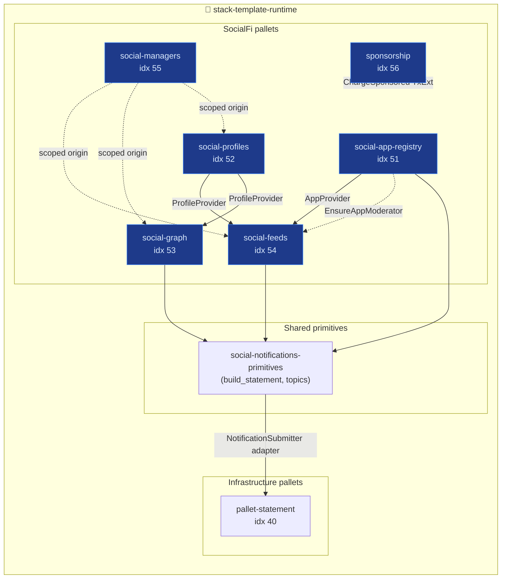
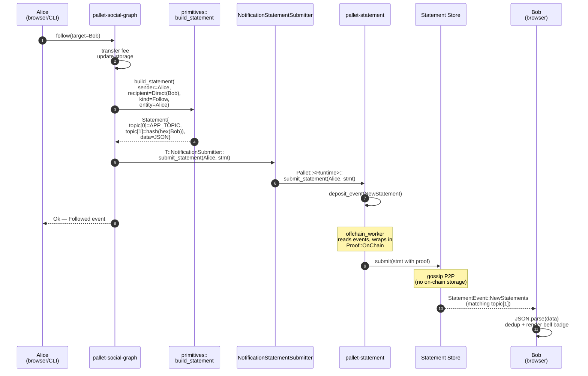
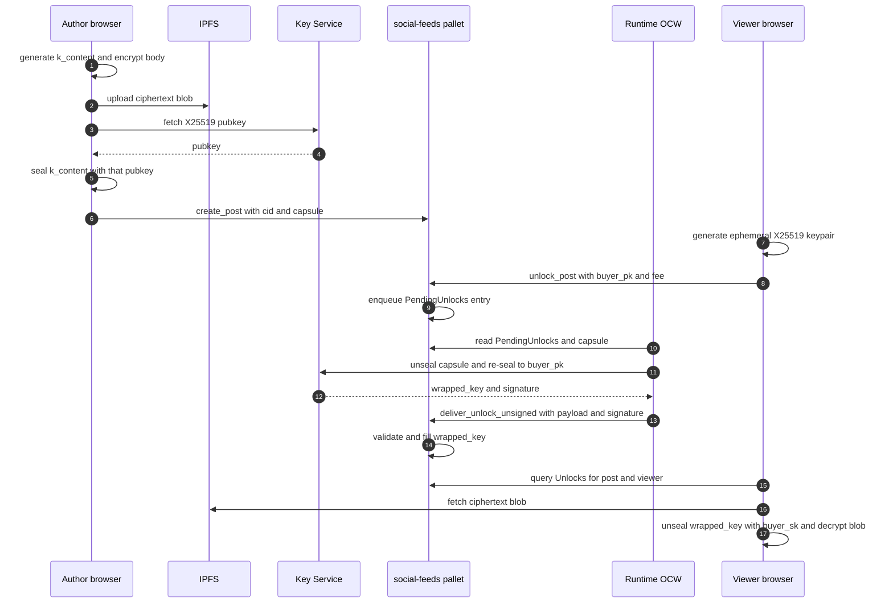
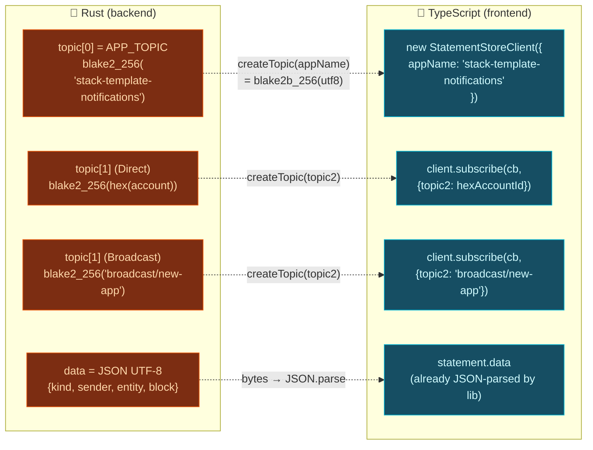
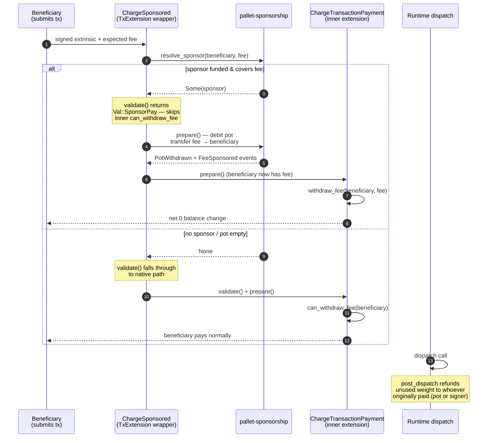

# Flows

Visual index of the four sequences that matter: runtime composition,
notifications, encrypted posts, and the notification topic contract.

## 1. Runtime composition

How the custom SocialFi pallets wire together inside the runtime.

## 2. Real-time notifications — Alice follows Bob

A single notification from extrinsic dispatch to Bob's bell badge.
`create_reply` and `register_app` follow the same pattern with
different topics and payloads (see diagram 4).

**Timing floor**: ~6 s end-to-end, dominated by block time. The
notification pipeline adds sub-200 ms.

## 3. Encrypted posts — publish and unlock

Three keys do all the work:

| Key | Algorithm | Purpose |
|---|---|---|
| `k_content` | XChaCha20-Poly1305 (32 B) | Encrypts the post body before IPFS upload |
| Key Service X25519 | `crypto_box_seal` | Wraps `k_content` into the on-chain capsule |
| Key Service sr25519 | `sr25519` | Signs `DeliverUnlockPayload` so the unsigned tx is accepted |

Viewer pays `unlock_fee` in the same extrinsic that enqueues the
request — the OCW only observes entries that already paid. The
in-repo X25519 secret (`blockchain/pallets/social-feeds/src/dev_key.rs`)
is a **dev stub**; production runs an external Key Service.

## 4. Notification topic contract

How topics are derived on the Rust side and re-derived in the
frontend so subscriptions match exactly.

Direct notifications target a specific account; broadcast ones fan
out to anyone subscribed to the well-known tag (e.g. `broadcast/new-app`).

## 5. Sponsored transaction — beneficiary pays nothing

`ChargeSponsored` is a wrapper transaction extension. It runs
**before** the native `ChargeTransactionPayment`, detects whether
the signer has a funded sponsor, and — if so — tops up the
beneficiary from the sponsor's pot in the exact fee amount. The
inner extension then withdraws that fee, net zero on the beneficiary.

Setup (one-time, by the sponsor):

1. `top_up_pot(amount)` — sponsor transfers native balance into their
   `SponsorPots[sponsor]` entry.
2. `register_beneficiary(beneficiary)` — writes
   `SponsorOf[beneficiary] = sponsor`. One active sponsor per
   beneficiary.

Per-transaction flow:

**Why wrap instead of replace**: the wrapper delegates everything
it doesn't care about — nonce, mortality, metadata, tip — to the
inner extension. Only the fee accounting path is intercepted.

**Why top up the beneficiary instead of charging the sponsor
directly**: it keeps the beneficiary's `AccountId` as the fee payer
of record for event/refund purposes, and lets the native extension
work unchanged even when the beneficiary starts with balance `0`.
