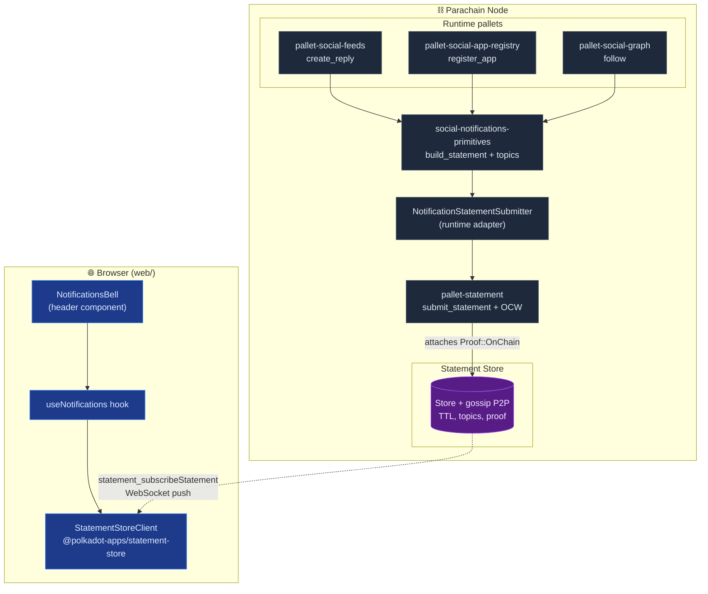

  <picture>
    <source media="(prefers-color-scheme: dark)" srcset="./assets/logo-dark.png" />
    <source media="(prefers-color-scheme: light)" srcset="./assets/logo-light.png" />
    
  </picture>

# Real-Time Notifications — Architecture

High-level view of how SocialFi pallets surface live notifications
through the Substrate Statement Store and the Parity-published
`@polkadot-apps/statement-store` client.

Three events today produce notifications:

- `pallet-social-feeds::create_reply` → direct notification to the
  parent post's author (skipped on self-reply).
- `pallet-social-graph::follow` → direct notification to the followed
  account.
- `pallet-social-app-registry::register_app` → broadcast to every
  subscriber on the `broadcast/new-app` topic.

No new pallet, no authority key, no extra offchain worker: we reuse
`pallet-statement`'s existing OCW to attach `Proof::OnChain` and
gossip the statement across the network.

## Component map

## Why this layout

- **`social-notifications-primitives`** is a `no_std` crate shared by
  every producing pallet. It owns the topic derivation logic, the
  JSON payload shape, and the `StatementSubmitter` trait. Pallets
  stay decoupled from `pallet-statement` itself — their mocks plug in
  `()` and ignore notifications during unit tests.
- **`NotificationStatementSubmitter`** lives in the runtime
  (`blockchain/runtime/src/configs/mod.rs`). It is a one-line adapter
  that forwards to `pallet_statement::Pallet::<Runtime>::submit_statement`.
  Keeping it in the runtime — not in each pallet — means every pallet
  is free of a hard dependency on `pallet-statement`.
- **`pallet-statement`'s OCW** is what actually hits the Statement
  Store host function. It scans `NewStatement` events per block,
  attaches `Proof::OnChain { who, block_hash, event_index }`, and
  calls `sp_statement_store::runtime_api::statement_store::submit_statement`.
  We piggyback on that hook — no custom OCW, no authority key.
- **Browser subscribes** via WebSocket RPC (`statement_subscribeStatement`)
  wrapped by `@polkadot-apps/statement-store`. The library handles
  reconnect, polling fallback and topic filtering.

## Files introduced

- `blockchain/primitives/social-notifications/` — the new crate.
- `blockchain/runtime/src/configs/mod.rs` — `NotificationStatementSubmitter`
  adapter + Config wiring.
- `blockchain/pallets/{social-feeds,social-graph,social-app-registry}/src/lib.rs`
  — `type NotificationSubmitter` in Config plus one `build_statement +
  submit_statement` call per extrinsic.
- `web/src/hooks/social/useNotifications.ts` — React hook.
- `web/src/components/social/NotificationsBell.tsx` — header bell.

See also:

- [`NOTIFICATIONS_FLOW.md`](./NOTIFICATIONS_FLOW.md) — end-to-end
  sequence diagram.
- [`NOTIFICATIONS_TOPICS.md`](./NOTIFICATIONS_TOPICS.md) — exact topic
  layout shared between Rust and TypeScript.
