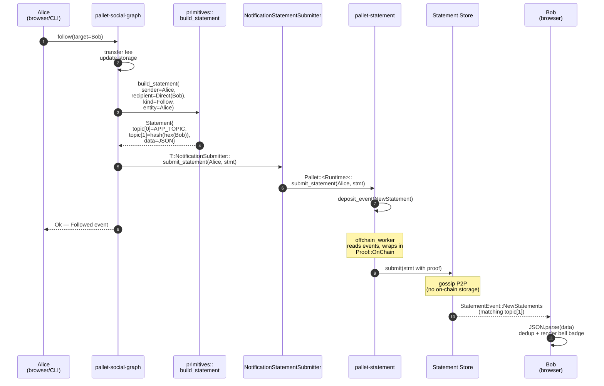

  <picture>
    <source media="(prefers-color-scheme: dark)" srcset="./assets/logo-dark.png" />
    <source media="(prefers-color-scheme: light)" srcset="./assets/logo-light.png" />
    
  </picture>

# Real-Time Notifications — End-to-End Flow

Walk-through of a single notification from the moment a user dispatches
an extrinsic to the moment another user's bell badge increments.

The example uses `social-graph::follow` because it exercises every piece
of the pipeline (direct recipient, JSON payload, gossip, subscription
filter). `create_reply` and `register_app` follow the same pattern with
different topics and payload contents — see
[`NOTIFICATIONS_TOPICS.md`](./NOTIFICATIONS_TOPICS.md).

## Sequence: Alice follows Bob

## Step-by-step

1. **Alice signs `follow(Bob)`** from the frontend or CLI. Standard
   signed extrinsic — nothing notification-specific yet.
2. **`pallet-social-graph::follow`** runs its usual business logic:
   profile checks, fee transfer, storage writes, `Followed` event.
3. **`build_statement`** is called at the end of the extrinsic with
   `Recipient::Direct(Bob)`, `NotificationKind::Follow`, and
   `entity_id = Alice` (the follower). Returns a proofless
   `Statement` with two topics set and a JSON payload.
4. **`T::NotificationSubmitter`** (abstract trait) dispatches to the
   concrete runtime adapter.
5. **`NotificationStatementSubmitter`** forwards to
   `pallet_statement::Pallet::<Runtime>::submit_statement(Alice, stmt)`.
6. **`pallet-statement::submit_statement`** deposits an on-chain
   `NewStatement { account: Alice, statement }` event. The
   `Followed` event from the extrinsic still fires — both events
   coexist in the same block.
7. **The extrinsic returns `Ok`** to Alice. Notification work adds
   zero dispatch weight beyond the `deposit_event` call.
8. **`pallet-statement::offchain_worker`** kicks in after the block
   is imported. It iterates `System::events()`, finds our
   `NewStatement`, synthesises `Proof::OnChain { who: Alice,
   block_hash, event_index }`, sets it on the statement, and calls
   the host function `sp_statement_store::runtime_api::statement_store::submit_statement`.
9. **The Statement Store** validates the proof (the event at
   `event_index` must be `NewStatement` from `Alice`), enforces the
   per-account allowance budget configured in runtime, and inserts
   the statement into the local store. P2P gossip propagates it to
   other nodes.
10. **Bob's node** receives the statement over gossip. Its
    WebSocket subscription filter — `{ matchAll: [APP_TOPIC,
    hash(hex(Bob))] }` — matches topic[0] and topic[1] of the new
    entry, so the node forwards it through the open
    `statement_subscribeStatement` channel.
11. **`@polkadot-apps/statement-store`** parses the payload as JSON,
    passes it to the callback registered by `useNotifications`.
12. **`useNotifications`** deduplicates by `(kind, sender, entity,
    block)`, prepends the new item to its state, and bumps the
    unread counter.
13. **`NotificationsBell`** re-renders with the new count. Clicking
    the dropdown marks the list as seen and deep-links to
    `/social/graph`.

## Timing in practice

| Phase | Approx. latency |
|---|---|
| Extrinsic → block imported | 6 s (block time) |
| Block imported → OCW submits to store | < 100 ms |
| Store → peer (local network) | < 50 ms |
| Peer → subscribed browser | < 50 ms |
| Browser render | < 16 ms |
| **Total (user experience)** | **≈ 6 s** |

The 6-second floor comes from block time, not the notification
pipeline itself. Anything sub-block — live typing indicators,
presence — would need a different primitive.

## Failure modes

- **OCW misses the event**: the statement simply never gossips.
  Subscribers see nothing. Retry would require re-dispatching the
  extrinsic, which is why on-chain storage (e.g. `Followed` event)
  remains the source of truth — notifications are a push-only
  convenience.
- **Store rejects the statement**: typically because the signer ran
  out of allowance (per-account byte budget in
  `pallet-statement::Config`). Logged by the OCW, no user-visible
  surface today.
- **Browser disconnected**: `@polkadot-apps/statement-store` runs a
  polling fallback (every 10s by default) so reconnection recovers
  missed statements until their TTL expires (30s default).

See [`NOTIFICATIONS_ARCHITECTURE.md`](./NOTIFICATIONS_ARCHITECTURE.md)
for the static view and [`NOTIFICATIONS_TOPICS.md`](./NOTIFICATIONS_TOPICS.md)
for the exact topic derivation.
