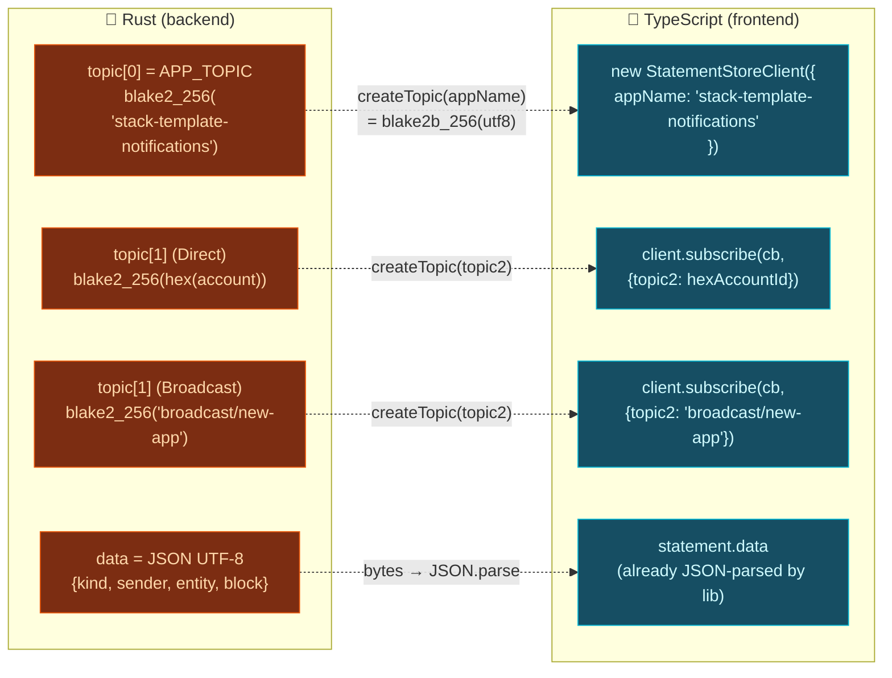

<p align="center">
  <picture>
    <source media="(prefers-color-scheme: dark)" srcset="./assets/logo-dark.png" />
    <source media="(prefers-color-scheme: light)" srcset="./assets/logo-light.png" />
    
  </picture>
</p>

# Real-Time Notifications — Topic Layout

The exact bytes that travel through the Statement Store, expressed
separately from each side of the wire so future reviewers can audit
that the Rust producer and the TypeScript consumer actually agree.

The convention mirrors the `@polkadot-apps/statement-store` NPM
client: `topic[0]` is a fixed "app namespace" hash so unrelated apps
sharing the same chain don't step on each other's gossip filter, and
`topic[1]` is what the library calls `topic2` — the routing key
subscribers filter on.

## Rust ↔ TypeScript compatibility



## topic[0] — app namespace

| Side | Expression | Value |
|---|---|---|
| Rust (`APP_TOPIC_NAME`) | `"stack-template-notifications"` | string literal |
| JS (`appName` config) | `"stack-template-notifications"` | string literal |
| Hash function | `blake2_256(utf8_bytes)` | — |
| Final 32-byte topic | `0x5d4266f5954da58f3b4de88893a14c47a23d9fa928067df935b29ae6841bec38` | |

The Rust constant is pinned at compile time to that 32-byte literal
and guarded by the `app_topic_matches_blake2_of_name` test, so any
accidental rename breaks the build. The JS side hashes the string at
runtime via `createTopic(appName)`.

## topic[1] — routing key

There are two recipients:

### Direct recipient (Reply, Follow)

Both sides hash the **lowercase hex of the SCALE-encoded account id,
without the `0x` prefix**.

| Side | Input to `createTopic` | Notes |
|---|---|---|
| Rust | `hex(account.encode())` | `AccountId32` encodes as 32 raw bytes, so hex length is 64 chars. |
| JS | `hex(ss58Decode(address)[0])` | Decode SS58 → 32-byte pubkey → lowercase hex. |

The `topic_for_recipient_matches_js_createtopic` test in
`social-notifications-primitives` locks the contract — if either side
changes its hex convention (e.g. adds the `0x` prefix) this test
breaks before the mismatch reaches production.

### Broadcast (new-app)

Constant string `"broadcast/new-app"` hashed the same way. Any
frontend that wants to learn about new apps subscribes with
`{ topic2: "broadcast/new-app" }`.

## Payload

Serialised as **JSON UTF-8** (not SCALE) so
`@polkadot-apps/statement-store` can `JSON.parse` it directly on
receipt. SCALE would be denser but would force the TS client to pull
codec dependencies just to decode a tiny record.

```json
{
  "kind": "reply" | "new-app" | "follow",
  "sender": "<hex of sender account, no 0x>",
  "entity": "<hex of relevant id, no 0x>",
  "block": 12345
}
```

Size budget: every field is hex or small integer, so even with a
32-byte `entity` (follower account) the encoded statement stays
comfortably below the 512-byte Statement Store limit.

## What each event emits

| Extrínseco | `recipient` | `kind` | `entity` (hex of) |
|---|---|---|---|
| `social-feeds::create_reply` | `Direct(parent_author)` | `reply` | the new reply's `post_id` |
| `social-graph::follow` | `Direct(target)` | `follow` | the follower account |
| `social-app-registry::register_app` | `Broadcast` | `new-app` | the new `app_id` |

`create_reply` skips emission when the replier equals the parent
author (no point notifying yourself). `register_app` and `follow` do
not self-filter because self-target is impossible for the former
(there is no "self-app" concept) and already rejected by the guard
`ensure!(who != target, CannotFollowSelf)` in the latter.

## How to subscribe

```typescript
import { StatementStoreClient } from "@polkadot-apps/statement-store";
import { ss58Decode } from "@polkadot-labs/hdkd-helpers";

const client = new StatementStoreClient({
  appName: "stack-template-notifications", // topic[0]
  endpoint: "ws://localhost:9944",
});

await client.connect({ mode: "local", signer /* any valid signer */ });

// Convert Bob's ss58 address into the hex the backend hashed.
const pk = ss58Decode(bobAddress)[0];
const hexPubKey = [...pk].map(b => b.toString(16).padStart(2, "0")).join("");

const sub = client.subscribe<NotificationPayload>(
  (stmt) => console.log("new notification", stmt.data),
  { topic2: hexPubKey }, // topic[1]
);
```

For broadcasts:

```typescript
const broadcast = client.subscribe(
  (stmt) => console.log("new app", stmt.data),
  { topic2: "broadcast/new-app" },
);
```

Both patterns are exactly what `useNotifications` does under the
hood — see `web/src/hooks/social/useNotifications.ts`.

## Limits and caveats

- **Library constraints** — `@polkadot-apps/statement-store` only
  surfaces `appName` (topic[0]) and `topic2` (topic[1]). The
  Statement Store protocol supports up to four topics; we leave
  topic[2]/topic[3] unused for now.
- **TTL** — statements expire after the Statement Store's default
  window (30 s). Missed notifications because the recipient was
  offline longer than that are simply lost; persistence would
  require an on-chain index, which defeats the point of going
  off-chain in the first place.
- **Max payload** — 512 bytes per statement. Large comment bodies or
  attachments must stay off the notification and live in the normal
  on-chain storage; `entity` is a pointer, not a payload.

See [`ARCHITECTURE_OVERVIEW.md`](./ARCHITECTURE_OVERVIEW.md) §9 for
the static system view and [`NOTIFICATIONS_FLOW.md`](./NOTIFICATIONS_FLOW.md)
for the step-by-step sequence of a single notification.
