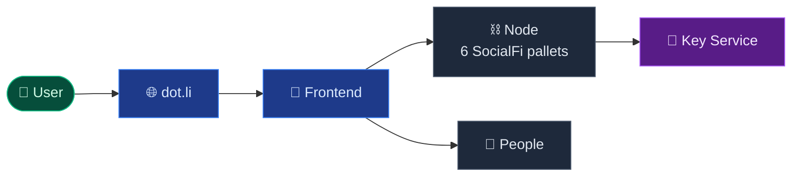

<!-- _class: lead -->

# SocialFi Protocol

### A composable social layer on Polkadot

**Germán Küber**

FRAME
PAPI
Statement Store
DotNS

---

## The problem

- Web2 social is **locked in**
- Web3 social is **siloed**
- Each app reinvents identity + graph
- Fees kill the UX
- No shared social substrate

---

## The solution

- **One runtime** — six pallets
- **Profiles + graph + posts** on-chain
- **Encrypted posts** end-to-end
- **Sponsored fees** onboard zero-balance users
- **Real-time notifications** via Statement Store
- **Identity** reused from Polkadot People

---

## What ships today

- 📬 Encrypted posts with capsule delivery
- 🔔 Live notifications, zero polling
- 💸 Gasless onboarding
- 🪪 Identity federated with People
- 🌐 App served from Bulletin chain
- 🗂️ Typed PAPI SDK out of the box

---

## Architecture

- **dot.li** serves the app from Bulletin chain
- **Node** hosts six pallets + OCWs
- **People** provides identity
- **Key Service** custodies encryption keys

---

## What's next

- **Now**: production Key Service
- **Weeks**: Postgres indexer + tests
- **Months**: XCM posts + mobile signing
- **Ecosystem**: pallets on crates.io + PAPI on npm

---

<!-- _class: lead -->

# Thank you

**socialfi.dot.li**

Questions?
